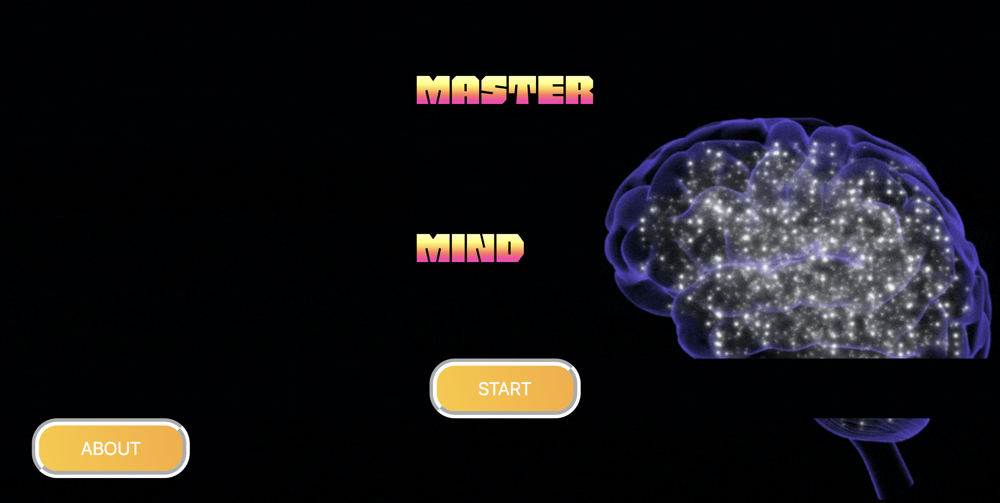
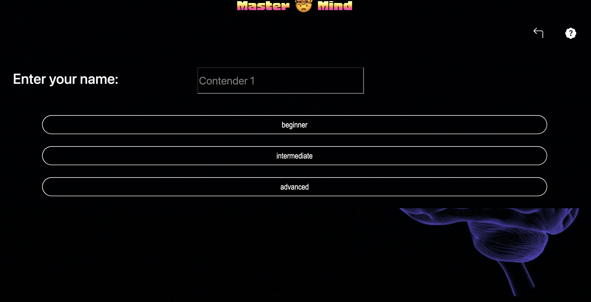

# GeeksHub Academy - Master Mind project

<em> Welcome to Master Mind Project from GeeksHubs Academy</em>

### General Data

**- Project Designer:** Marissa Rico

**- Project Tittle:** Master Mind Game 🤯 🤯

  
Table of Contents 

  <ol>
  <li><a href="#Objective-🎯">Objetive</a></li>
  <li><a href="#About the project-🔎">About the Project</a></li>
  <li><a href="#Deploy-🚀">Deploy</a></li>
  <li><a href="#Views">Views</a></li>
  <li><a href="#Licence">Licence</a></li>
  <li><a href="#Contact">Contact</a></li>
  </ol>

## Objective🎯

This is a game where a code (sequence of colors) is automatically randomly selected and hidden.

Then the code braker get to have some chances and guess the code colour. You can choose your level Beginner, Intermediate and Advanced.

🤯 If you fail do not worry 🤯 Try again and Lets have some fun!!

## About the project-🔎

A Multi-Page Application (MPAs). The project is created with Bootstrap 5.3 Framework , html5 , CSS3, Javascript Vanilla and Flexbox.

## Views

Start the game

Choose your colour

Let´s rock!

# Deploy 🚀 🚀

<a href="https://maricode-40.github.io/Mastermind-project3/index.html"> production URL </a>

## Licence

This project is under licence of "My Name".

## Contact 👩🏽‍💻

